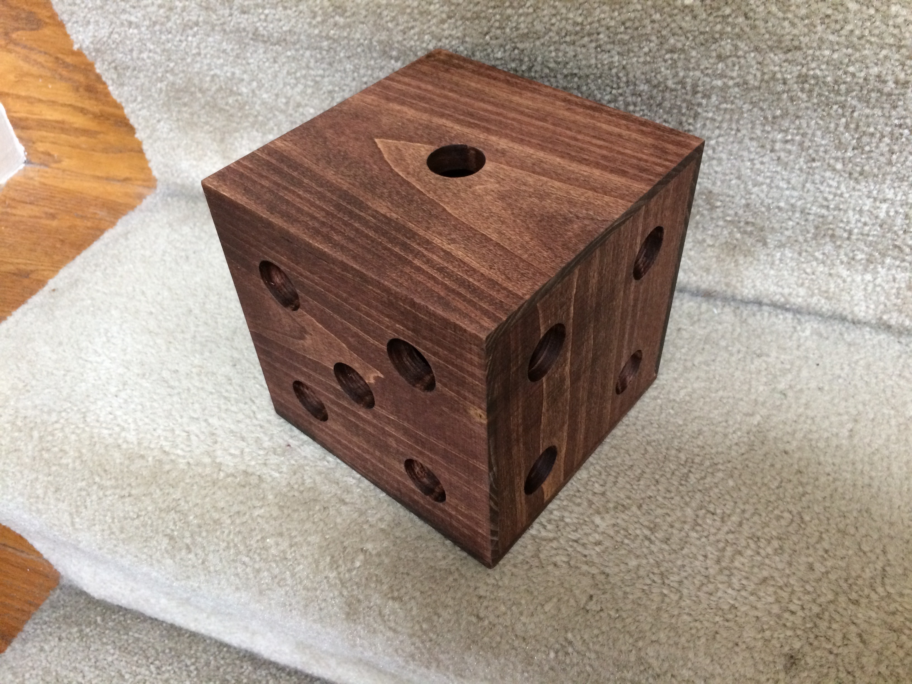

# Readme

A Project to make a large 6" cube gambling die out of wood on a CNC router and out of plastic on a 3D Printer as a learning exercise.

Included here are the Fusion 360 CAD files, DXF files, and STL files.

* <a href="die v7.dxf">die v7.dxf</a> -- 2D line drawing for use with CNC Router

* <a href="die v7.f3d">die v7.f3d</a> -- Autodesk Fusion 360 CAD source file

* <a href="die v7.stl">die v7.stl</a> -- 3D object file for 3D printing

* <a href="Wooden Die Drawing v3.pdf">Wooden Die Drawing v3.pdf</a> -- Mechanical Drawing of parts

* [images.md](images.md) -- Pictures

The Wooden faces were cut from 8"x1" (lumber dimensions) Poplar, planned down to the 1/2" thickness and then cut on a ShopSabre cnc router.  The "die v7.dxf" file here was used with the Vcarve Software to program the ShopSabre.

The resulting board was then cut apart; sanded; stained on the inside faces; glued together; sanded, stained, and waxed.

The small 3D Printer plastic cube was printed from the stl file here.  The parts were scaled to make the small parts and allow all 6 sides to be printed at once.  They were then glued together to create the cube.

Many thanks to everyone at (Nova-Labs.org)[http://nova-labs.org/) who helped me learn the skills needed to make this and provide me with access to the machines to make this possible.

Curt Welch
curt@kcwc.com
5-1-2017

