3D-Printing the small plastic version to verify geometry.
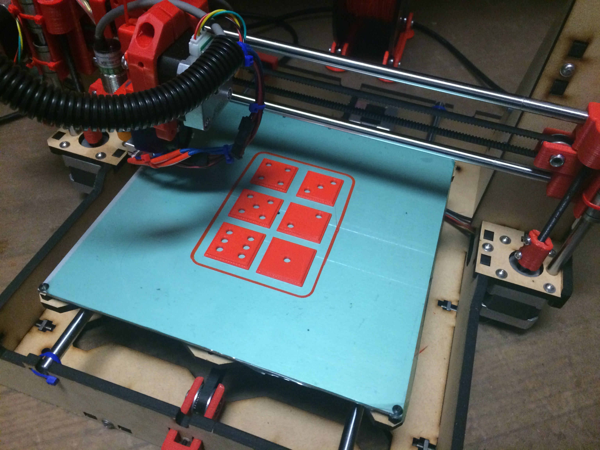

Finished CNC Router work, with an Aluminum version I made years ago, and the 3D printed plastic version for reference.
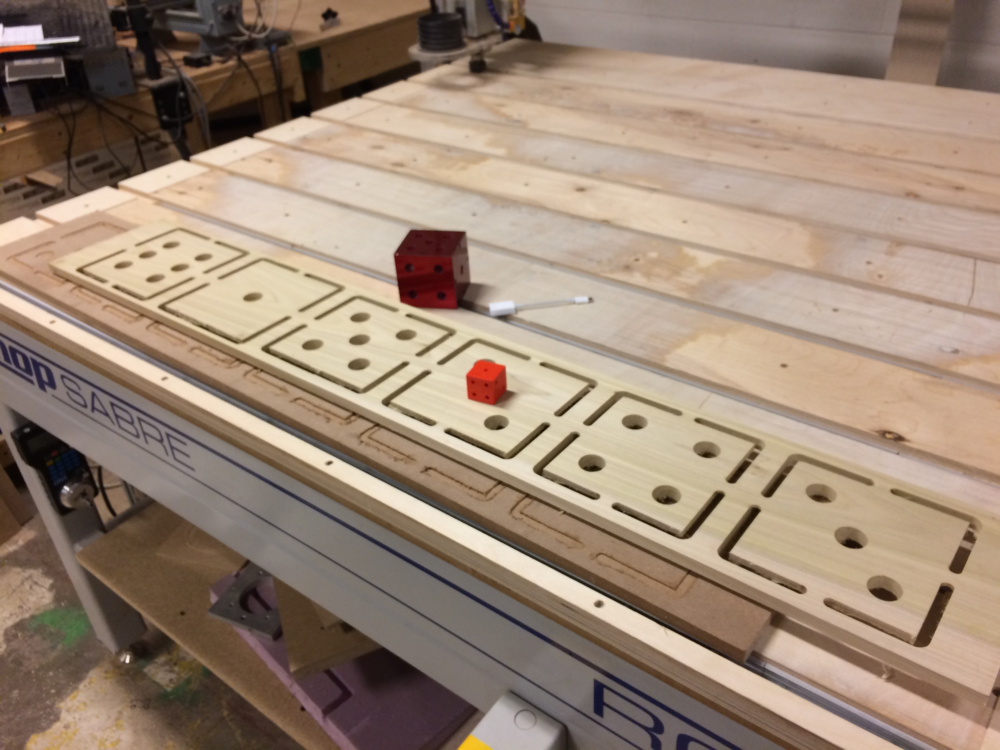
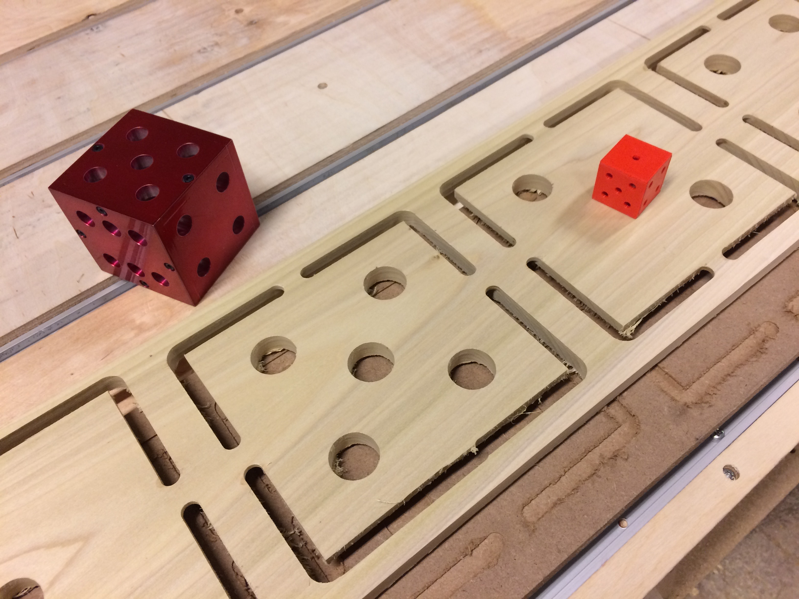

Cleaning up edges by hand.
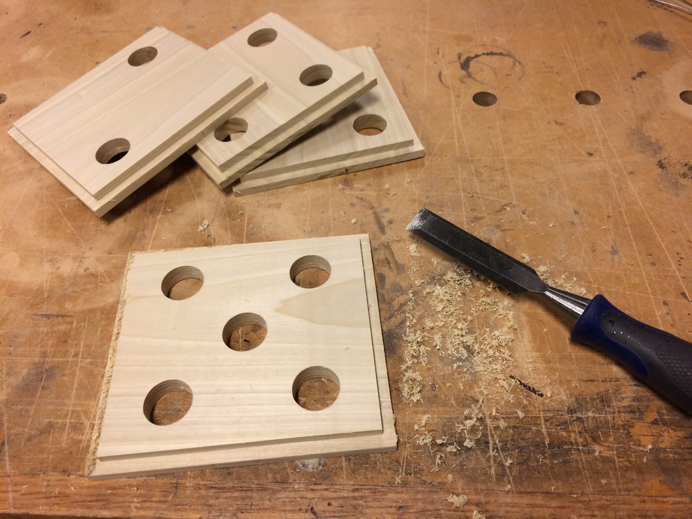

Staning and gluing.
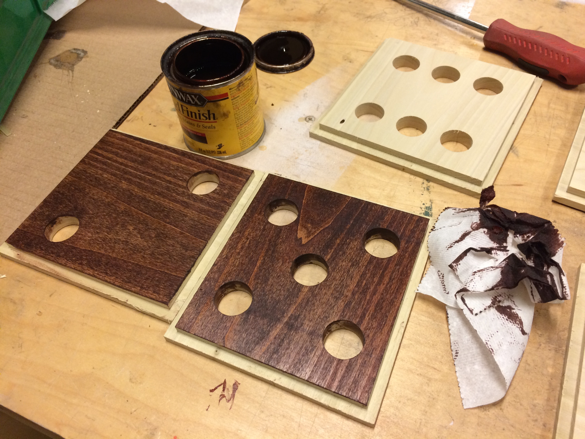
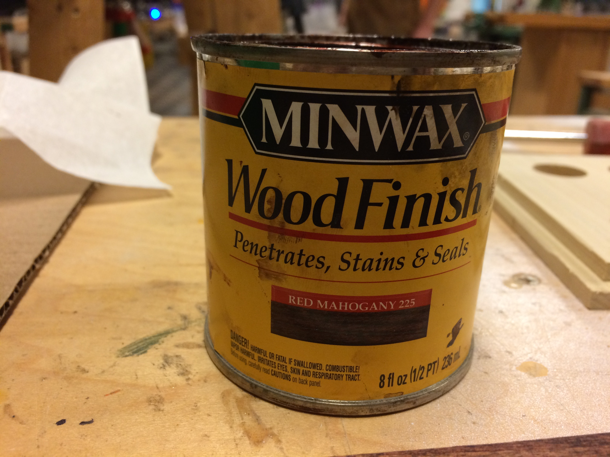
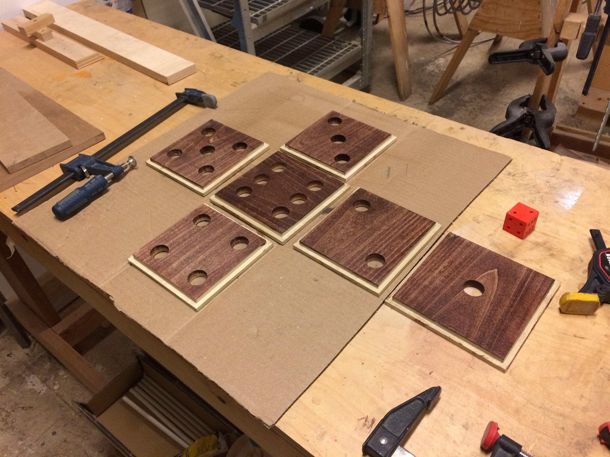
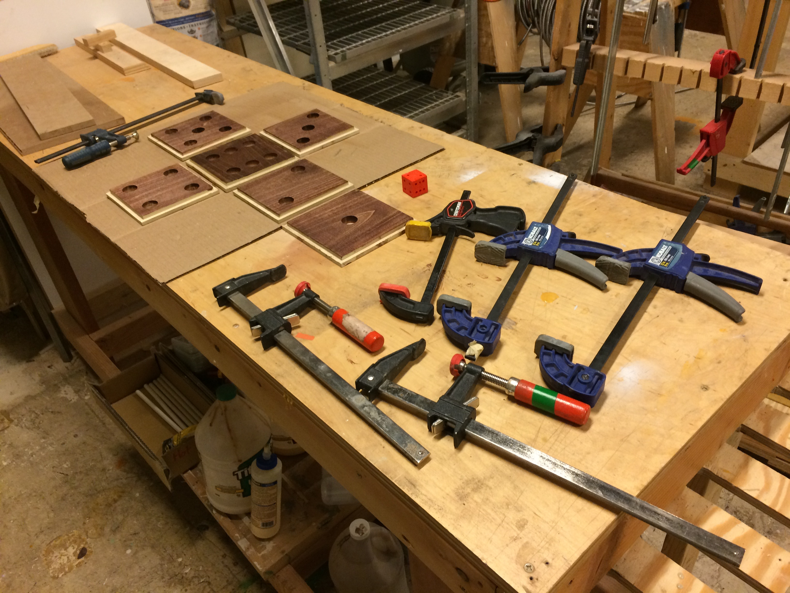
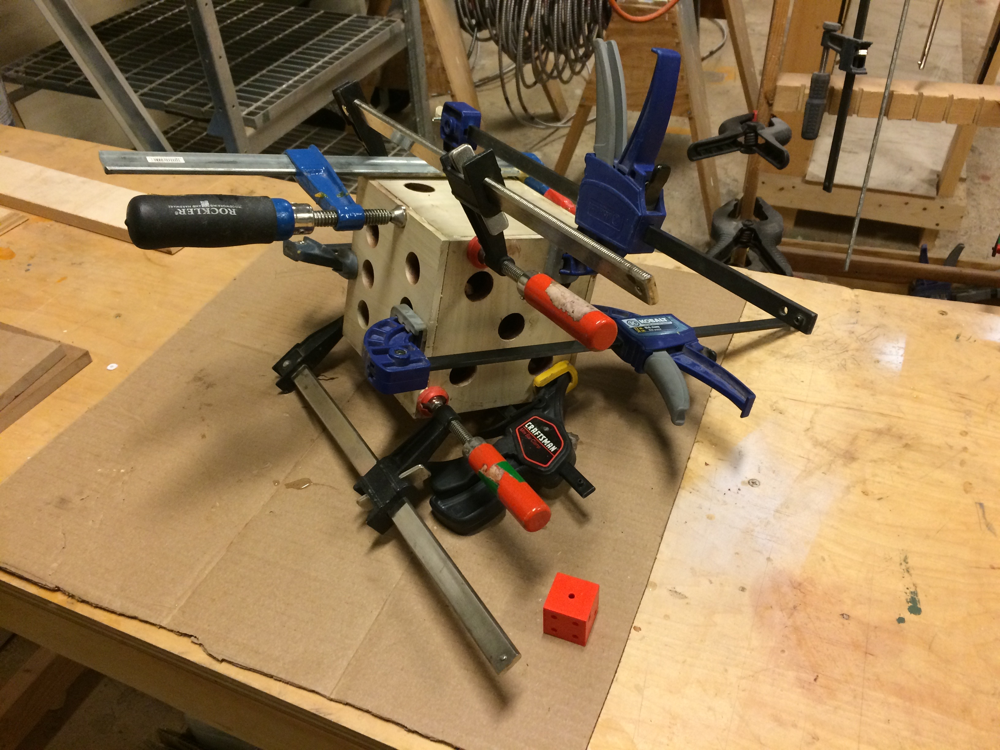
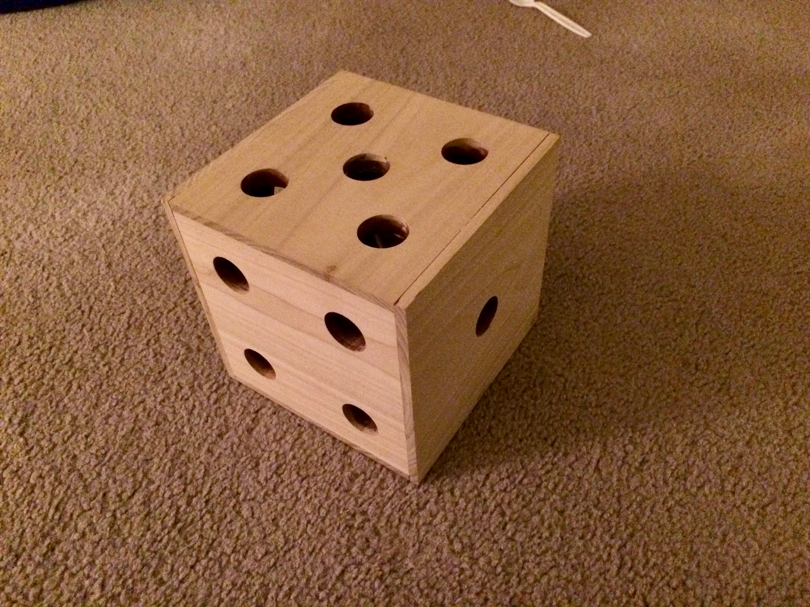

Finished version.
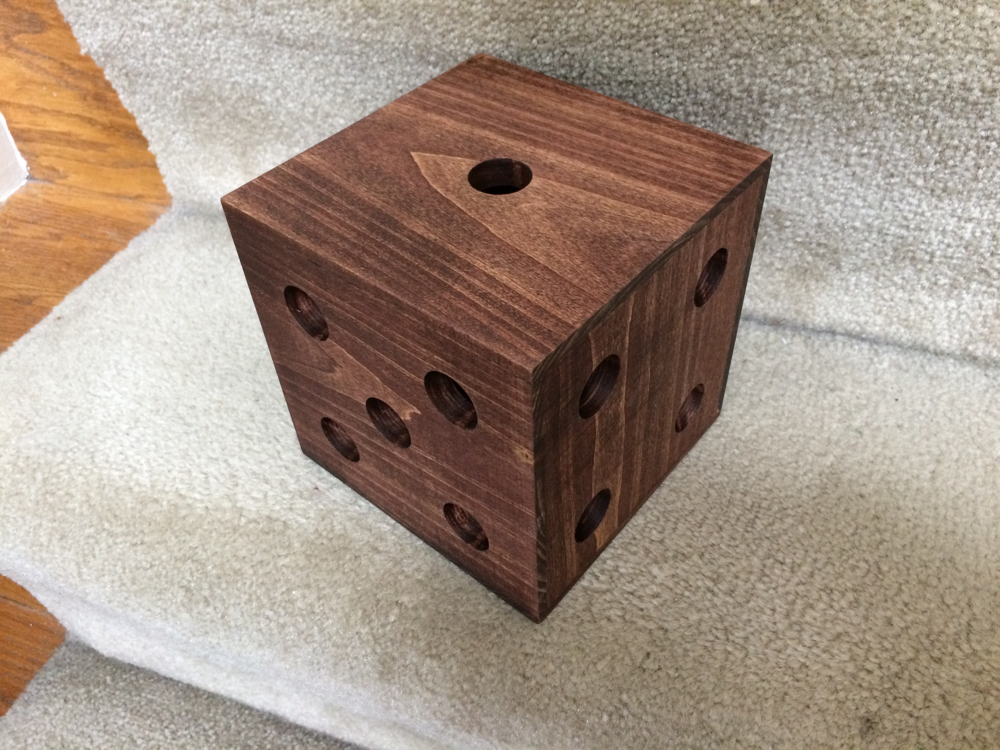
